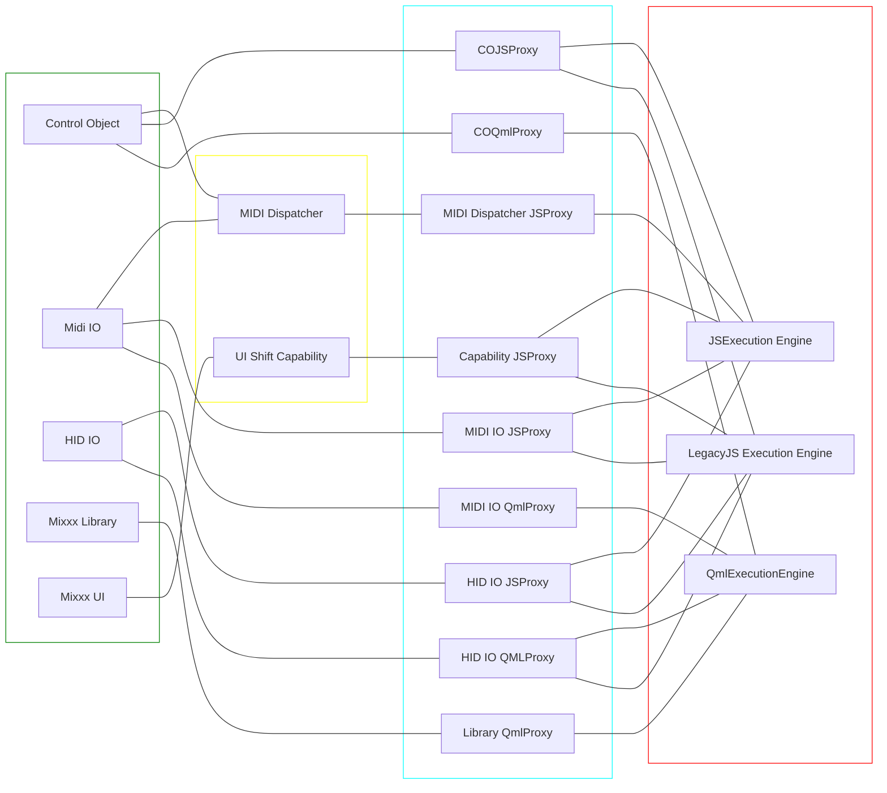

# Controller Engine V2

* **Owners:**
  * @Swiftb0y, @acolombier

* **Implementation Status:** `Not implemented`

* **Related Issues and PRs:**
  * [Create a reactive programming API for
    controllers](https://github.com/mixxxdj/mixxx/issues/13440)
  * [QML-based components API for
    controllers](https://github.com/mixxxdj/mixxx/pull/13459)
  * [Respect the Midi timestamp when
    scratching](https://github.com/mixxxdj/mixxx/issues/6951)
  * [make brake, soft start, and spinback part of the effects
    system](https://github.com/mixxxdj/mixxx/issues/8867)
  * [Move the controller screen rendering feature away from
    `ControllerScriptEngineLegacy`](https://github.com/mixxxdj/mixxx/issues/13203)
  * [Confusing Midi Sysex
    handling](https://github.com/mixxxdj/mixxx/issues/12824)
  * [Ability for controller to share data at
    runtime](https://github.com/mixxxdj/mixxx/pull/12199)
  * [Allow Controller Mappings to be located in their own
    directory](https://github.com/mixxxdj/mixxx/issues/9906)
  * [support external displays on
    controllers](https://github.com/mixxxdj/mixxx/issues/8695)
  * [Handle hot-plugging and graceful recovery of
    controllers](https://github.com/mixxxdj/mixxx/issues/5614)
  * [Controller scripts need to be able to
    cross-communicate](https://github.com/mixxxdj/mixxx/issues/5165)

This document is supposed to serve as an overview for a new controller engine
for Mixxx. This does not only refer to the runtime "execution engine" of some
mapping specific code, but almost all aspects from protocol IO, to the metadata
schema, point-and-click mapping editor, and the scripting API.

## Definitions

* Mapping: a file or set of files which defines everything that’s needed to a
  controller to communicate with mixxx
* Controller: Physical self-contained piece of hardware, possibly consisting of
  multiple sinks and sources
* Source: a source of data from the controller (midi/HID messages from a
  particular port/endpoint)
* Sink: a port/endpoint of the controller that receives data from mixxx (e.g
  screens, HID output report, write bulk endpoint are example of different sink
  types)
* Manifest: Metadata about the controller definition. Execution Engine and
  Source/sink topology. (equivalent to what we do with the XML in the current
  legacy engine)
* Execution Engine: Scripting engine that evaluates the scripting source files
  of the engine (so essentially what makes the scripting interactive/smart)
* Module: ES6/QML Module that's part of a mapping, evaluated in an execution
  engine (its what you expect ;) )
* Capability: abstract definition of a concept that is not native to mixxx (eg.
  shift, controlling different decks with the same physical hardware (1/3, 2/4
  deck switching)). This is needed for “open-ended” cross-mapping communication
  (avoiding “controller lock-in”).
* Point-and-click editor: A tool to easily customize a controller mapping by
  clicking a button on screen and on the hardware surface and those two
  corresponding to each other.

## Why

The current controller engine suffers from a number of issues primarily
summarized as a lack of flexibility.

### Pitfalls of the current solution

To summarize the issues linked in the Related Issues and
PRs section:

 1. The current controller engine is not able to handle multiple controllers at
    once. This is important when a single piece of hardware is advertising
    multiple different control endpoints (eg HID + Bulk for control + screens
    such as Native Instruments Traktor devices) as well as when multiple pieces
    of hardware are supposed to present a single unified control surface (such
    as the modular Behringer CMD-MM1/-PL1/-DC1/-LC1 or modular NI Traktor
    Kontrol F1/X1/Z1). Being able to bundle multiple different endpoints into
    the same mapping is important for a good user experience and to allow for
    more complex mappings.
 2. The current controller engine (`ControllerScriptEngineLegacy`) is not able
    to support modules of any kind. This is important for code organization and
    reusability. In order to increase mapping code quality and maintainability,
    it is important to be able to split the mapping code into multiple files and
    to be able to reuse code between different mappings. This is especially
    important now that mapping authors are starting to reuse functionality
    across different hardware devices (see Numark NS6II and Mixtrack variants or
    similarity between different pioneer controllers)
 3. Current mappings modify global state and assume that they are the only
    mapping running. This needs to be fixed in order to support multiple
    mappings running at the same time in the same "execution engine".
 4. Device hotplug is currently not possible / hard to implement. This is
    primarily because of the underlying protocol IO layer not willing to support
    it. This document proposes an alternative approach that lets us more easily
    switch the underlying library.
 5. Allow changing the manifest format. Many people have expressed distaste in
    the XML manifest format. Careful implementation of the new format should
    allow experimentation with different formats.
 6. Changing out infrastructure like this is virtually impossible. The proposed
    architecture is designed to be modular and allows for all the required
    components to be implemented gradually.

## Goals

Goals and use cases for the solution as proposed in [How](#how):

* Allow multiple controllers to be used at the same time.
* Mappings should be able to organize themselves into modules.
* IO protocols should easily be changeable and not not be tied to the mapping.
* Allow easy, gradual implementation of the system.

### Audience

This is primarily targeted at developers and power users who are interested in
the controller engine. End-users only interested in the point-and-click mapping
editor should not experience any significant changes.

## Non-Goals

* Replace `ControllerScriptEngine` in the short term until we are confident in
  the new design.
* make changes to the scratching code as it is orthogonal to this proposal.
* Make changes to the effects system as it is orthogonal to this proposal.

## How

Explain the full overview of the proposed solution. Some guidelines:

### File Structure

Built-in mappings reside in `res/controllers/` where each mapping is a directory
containing at least a manifest file named `manifest.xxx` (where `.xxx` is the
language-specific file extension (eg. `.xml`, `.yml`, `.json`, etc)).
Additionally, `res/controllers/lib` contains shared modules that can be used by
multiple mappings (such as componentsJS).

### Manifest

The manifest is a declarative file that describes the mapping. It contains the
following information:

* Sources and Sinks
* Execution Engines
  * Used Mixxx APIs
* Capabilities

### Sources and Sinks

Sources and Sinks are the endpoints of the controller. They are defined in the
manifest and are used to define the IO protocol of the controller. They are
characterized by their protocol (eg. MIDI, HID, Bulk, etc), their direction (eg.
input, output, bidirectional) and optionally explicitly their underlying
implementation (eg. `portmidi`, `rtmidi`, `libremidi`, etc). They will also
contain a heuristic description to map the source/sink to the physical
controller (protocol specific, in the case of HID, usb vid&pid could be used for
example).

### Execution Engines

Execution engines is yet another section of the manifest. It defines the
scripting engine that will be used to evaluate the mapping. It is defined by its
type (JS, QML, something else?) along with a specific entry point. In the case
of JS, this would be a ES6 module that exports a controller class to be
instantiated. In the case of QML, this would be a QML file that defines a
controller object.

### Capabilities

Capabilities are the concept that allows for cross-mapping communication while
avoiding controller-lock-in. They are defined by mixxx and are used to define
concepts that can't be easily mapped to ControlObjects. For example, a
capability could be `shift` or `deck-switching`. Capabilities are defined in the
manifest and can be used by the execution engine to communicate with other
mappings. Capabilities are essentially "opt-in" APIs.

### Point-and-click editor

In order to still support the point and click style use-case, we add yet another
section that directly connects patterns of midi messages to a control object.
This section is again attached to a source/sink. There is no support for
interacting with an execution engine via this section. This essentially works
like the current mapping editor, but removes the
`<key>path.to.some.JS.input.handler</key>` feature as it is not compatible with
the new architecture. This method is favoured over code generation as that is
not always possible, nor would it likely produce a good result. Moreover, this
would let us recycle parts of the current codebase. _No need to reinvent the
wheel._ Execution engines can still be wired up explicitly to access the
dispatcher here as well. This is to avoid the need to have a separate dispatcher
defined in the mapping and for easier integration with "hybrid" mappings. the
API is essentially already implemented as [Registering MIDI Input Handlers From
Javascript](https://github.com/mixxxdj/mixxx/pull/12781), though QML would need
a separate declarative API.

### Wiring it all together

Since this flexible layout results in a many-to-many relationship sources/sinks
and execution engines, we specify a separate section in the manifest that
defines how sources and sinks are connected to execution engines.

### Sharing mappings with modules

In order to share mappings that access modules outside the mappings root folder,
the execution engine must be able to create a list of all files accessed and
export them along the controller files. This would be done by creating a copy of
all the required files in the root of the mapping during exporting. That tree is
then overlaid over the built-in libraries. This is currently only possible
within a `QQmlEngine` using `QQmlEngine::addUrlInterceptor` and
`QQmlEngine::addImportPath`.

### Mixxx APIs

In order to obtain optimal developer experience of mixxx APIs in the execution
engine, each execution engine should have its own implementation that maps
idiomatically to the strengths of the execution engine. This is especially
important for QML, as it is a reaktive declarative language that does have many
more features than JS. This is essentially already the case in our current
codebase, see `*JSProxy` and `*QMLProxy` classes as examples.

### Migration from `ControllerScriptEngineLegacy`

We can gradually transition to the new architecture by modelling the semantics
of `ControllerScriptEngineLegacy` as a separate execution engine. This would
allow us to gradually migrate old mappings to the new architecture.

## Current unknowns

How feasible is the heuristic detection of sources and sinks? How do we handle
multiple sources/sinks of the same type originating from different controllers?
Eg how do we avoid that the screen from one piece of hardware is connected to
the wrong controller?

## Alternatives

1. Shoehorn the new architecture into the existing `ControllerScriptEngine`
   class. This would not eliminate the one-controller-per-mapping limitation and
   would not allow us to iterate on the design nor on the API.

## Architecture summary

## Action Plan

The following action plan is very abstract because the architecture is designed
to be implemented gradually. Once we have decided on priorities, we can decide
on a more concrete plan.

1. Define the abstract Manifest outline.
2. Implement a concrete manifest parser of the basic outline.
3. Choose any component from the architecture summary diagram and implement it
   using tests and making instanstiable by via the manifest.
4. Once 2 connected components are implemented, implement their connection via
   the manifest.
5. Repeat until all components are implemented.
