# Mixxx QML interface

* **Owners:**
  * `@acolombier`

* **Implementation Status:** `Accepted, not implemented`

* **Related Issues and PRs:**
  * `<GH Issues/PRs>`

* **Other docs or links:**
  * `<Links…>`

> TL;DR: New design proposal and UI axioms to be followed for Mixxx 3.0 and design suggestions.

## Why

* Replace QWidget to QML interface to simplify customization, maintenance, performance and hardware support
* Stop development on the homemade theme system and move it to maintenance
* Propose a new look for certain Mixxx feature which suffered legacy decision (Library, Waveform)
* Orient our UX choices to better support lighter platform (tablet, smartphone, laptop with touchscreen)

We propose a comprehensive redesign of Mixxx's user interface to simplify customization and maintenance by migrating to
QML. This will enable us to stop development on our homemade theme system and transition it to a maintenance phase,
freeing up resources for more innovative features. A fresh look will also be introduced for the legacy-designed Library
view and certain element such as Waveform grid control button, making them more intuitive and modernized. The
redesigned interface will also support lightweight platforms, including tablets, smartphones, and laptops with
touchscreens.

### Pitfalls of the current solution

There is a few issues with the current UI for Mixxx when it comes to compatibility with on the go devices (tablet and
smartphone), which include:

* Popup windows, sometime blocking
* All features laid out on a single layer. Section may be collapsed
* Flat design - popup sections are complicated to do and require a lot of C++ boiler plate (e.g hotcue popup)

## Goals

* Allow easy collaboration and decision making on design ideas.
* Have a consistent design style that is readable and understandable.
* Have a design style that is concise and covers all the essential information.
* Give Mixxx a lifting.

### Audience

The audience of this change is any Mixxx user. As a breaking change, the primarily focus should be on Mixxx core
members, but any feedback from contributors or user is also welcome.

## Non-Goals

* Change 2.x themes porting effort such as
  [PaleMoon](https://mixxx.zulipchat.com/#narrow/channel/109171-development/topic/Figma.20design.20for.20the.20QML.20version/near/474994732)
* Restrict UI decision strictly to the suggested design. **All visual are suggestions!**

## How

> [!NOTE]
> Currently, all visuals were made with a restricted color pallet of 5 colors + 2 accents colors. Please note that this
> could be reviewed in iterations to add more depth

### Summary

_Startup_

_Live performance_

_Preferences_ (**Note there is blurred overlay, but it doesn't seem to rendered in SVG**)


### Alerts and notifications

This new theme should refrain from using popup window which are not friendly to user on touchscreens or are entirely
relying on controllers to drive Mixxx. Notifications could also be used for further user iteration such as tips or
context/system insight (as an example, a detected supported controller)

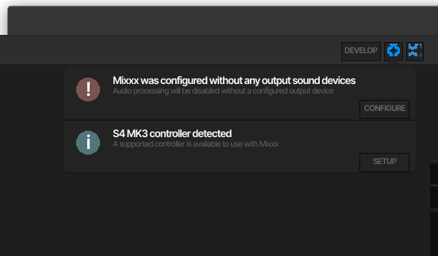

### Reactive UI overlay popups

Unlike our precedent theme, this new design aims to allow advanced action to be done in overlays which can allow access
to extra information without requiring to change the layout or overload it when unused. Here are some examples

_Hotcue edit_\
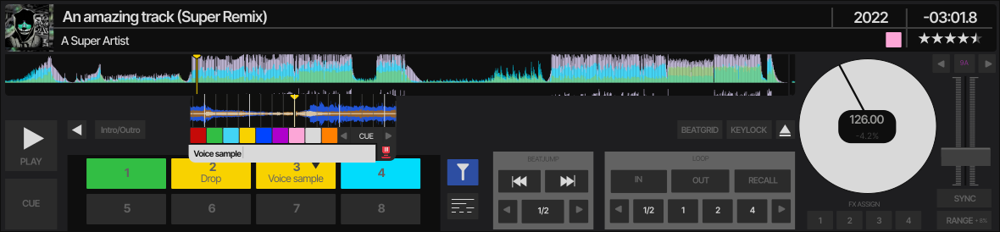

_Beatgrid edit_\
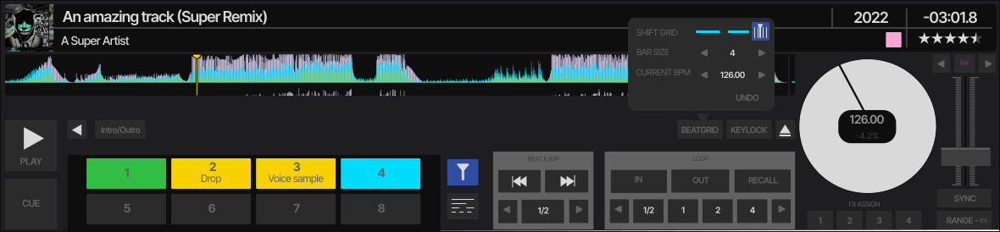

_Playlist details_\
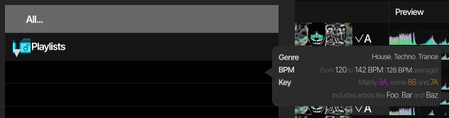

### Search bar provide more capability of the engine leveraging the engine

I recently stumbled across the search syntax on the documentation and discover that Mixxx had a fairly powerful search
capability. Sadly, the simple text input in our current themes doesn't make that very clear and requires a less
friendly experience using some bespoke search syntax (or as I call it, the "mixxxql"). With the new overlay approach,
we cwe could imagine a search experience more interactive and dynamic:

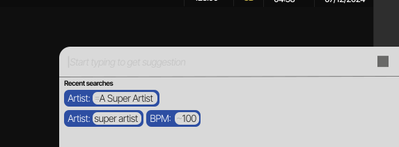
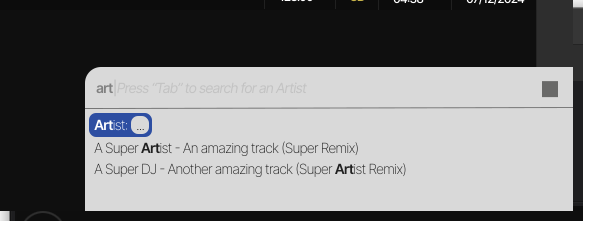
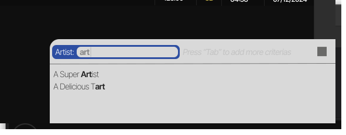
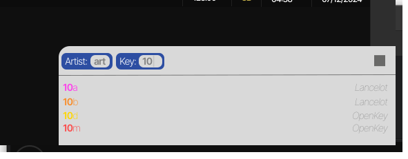

### Add more interactions on settings and preferences

Here is a suggestion on how the audio routing could look like:

The general UX behavior as currently imagined is:

* Point-n-click/touch an edge, then another, or drag and drop between edge
* Long click or context click on existing edge to undo them

Note that it includes a switch to help reducing the amount of routing customization and help keeping the information
relevant to the user and their needs. It also include a `Legacy` mode to allow user to get the 2.x experience it can
the new one is too overwhelming.

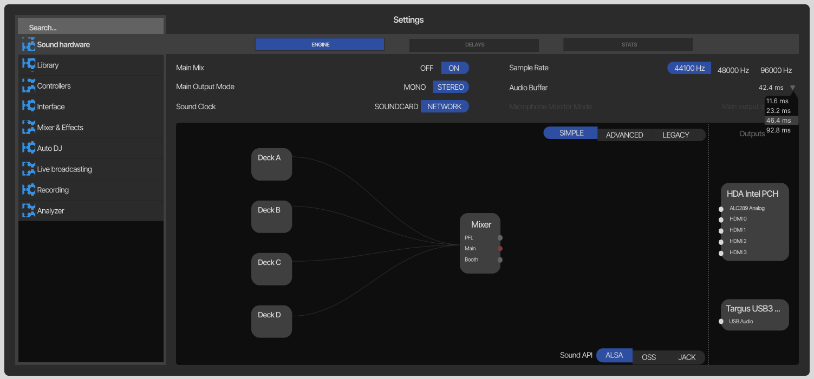
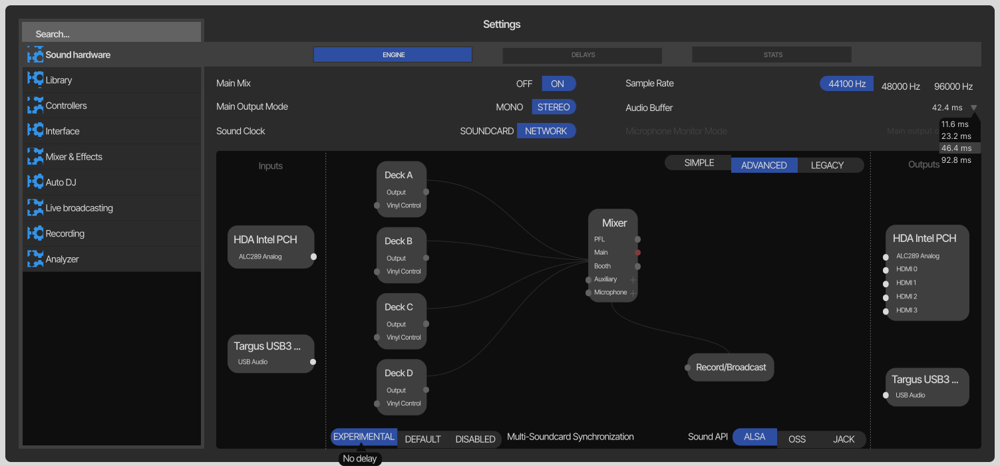
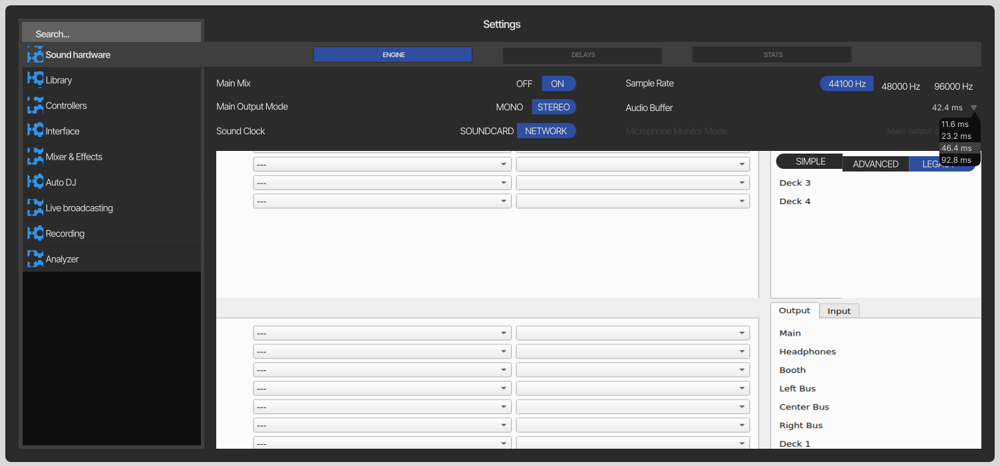

Here is a suggestion on how controllers could be reworked


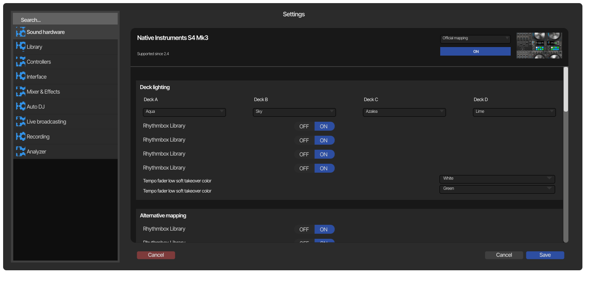

Here is an example of how this could be done for waveform, allowing changes feedback directly in  the setting, rather
than on the UI itself, as it is currently. This would simplify massively the current waveform legacy and remove the
need for the `WaveformFactory`


**Bonus**: [The whole Figma design](
./contents/2024-11-16_qml_interface_global.svg)

### Feature and UX changes summary

#### Search

The new search experience offers better usability of the advanced search options by abstracting the operator concept.
These will still work but they would render differently to allow user who are unaware of the "MixxxML syntax" to steal
leverage this capacity. This change aims to create an experience similar to what you would find on the Github issue/PR
search bar

#### Controller mapping setup

There is few life improvement in the suggested design, but the most significant and disruptive change is the interface
for point-n-click. The idea would be to allow any MIDI device to use the designer approach. Eventually, we could also
introduce this UI for HID devices, as it seems possible to implement automated learning function based on the HID
report changes, upon user actions. This is something I have fully prototyped locally some time ago (shared upon
request). Additionally, some vendor (like NI) seems to properly fill the descriptor HID field which allow a more driven
approach to learning.
Finally, this view can be used to automatically generated streamlined UX for the manual, but also ship this manual
directly into Mixxx to help with easy onboarding, and potentially advanced feature like search for a an action (e.g
`enable hotcue 6` and get the button highlighted on the visual)

In terms of **migration**, the idea would be to automatically generate buttons in a grid based off the XML `control`
entity and group them within within zones, based from the `group` they are related to. This should help user to focus
on simply adjusting the layout and the input type. The metadata about positioning, input types or properties will also
be eventually serialized into the XML file, as an additive change, which should make it non-breakable to the version
`1` currently live.

#### Library layout

The library layout offers more flexibility around customization and aims to move away sections from the sidebar that
tends to bloat the current experience. These feature would be move on a side menu, which would also naturally allow a
split view, game changer to help with playlist preparation.

#### Alternative deck layouts

The alternative layouts allow users to customize the component disposition on their deck and mixers, as well as have
multiple layouts that they can use depending the Mixxx usecases, such as live performance, radio broadcast, etc.


### FAQ

> :question: Some of the controls are quite small while others are quite large

It's worth to say that the whole design will use a bit of standardization as well as some accessibility work. It's
likely that some of it will be done as we implement the mockup. Ultimately, we should ensure components can adapt to
various size, in order to improve usability for our user with vision disabilities. This is not a trivial task, but this
could be a goal to tend to.

> :question: hotcue popup, how to access (and how can we make it touch friendly)

Nothing set in stone, but a responsive approach could be to hook the popup to:

* Right click (to respond to mouse event)
* Multi touch on "Hotcue" button and the hotcue itself (to respond to touchscreen inputs) - can be done using a
  [MultiPointTouchArea](https://doc.qt.io/qt-6.5/qml-qtquick-multipointtoucharea.html)

> :question: From very old discussions in regards to search: A multi-window library is highly requested and needed too:
> Either for multiple access (eg one library view per CDJ), or popping it out into another window (frequently
> requested) or being able to more easily organize tracks by via drag and drop

This is a very fair request, and something I had already prototyped last year (see `acolombier:qml-library-table` if
interested). While this prototype was perhaps to involved (it was allowing the user to reorganize anything in the
library view), we could imagine some subset of it. Here is a design example.

_Library menu button_\
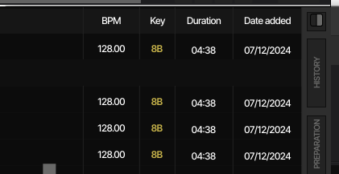

_Library split view_\
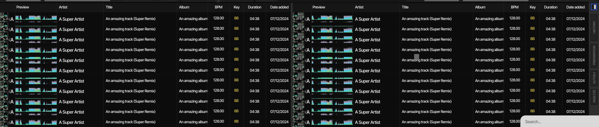

(**Note**: _we could make the button right-clickable to pop the split view out in a windows on computers_)

This is fairly trivial to do in QML, thanks to the model-driven components.

> :question: Soundhardware graph is cool, but feasibility and especially user-friendlyness is questionable. Would be
possible to fallback to pipewire directly?

Falling back to pipewire would likely require a significant work to support it into Mixxx directly. While this is a
great feature, it would probably be best to make the QML/v3 effort not dependent on this change. This will also only
work for Linux and would leave devices that are likely to suffer from UX behind (Android or iOS).
It would however be possible to add a "switch" button to allow user user the combobox matrix view instead, as
`TableView` and models would make it very easy to build a dynamic view alternative, aligned with the existing design.

Regarding the usability problems, one main effort will be around making sure there is none (or at least no major one).
This is a non-exhaustive list:

* Adding a tutorial view to be show at first use, in order to help the user understanding the use of this view
* Ensure a first-class support of touchable interface

> :question: Livepreview of the waveform is nice, though potentially not trivial depending on how much the skin can
itself can customize it

That's beauty of QML - we can make as much as we want customizable! Currently, the existing component allows
customizing the positioning, signal source, the color and the coloring algorithm. Here is an example of a very
different customization that could be done with a trivial change

```diff
  Mixxx.WaveformOverview {
      anchors.fill: parent
-     channels: Mixxx.WaveformOverview.Channels.LeftChannel
-     renderer: Mixxx.WaveformOverview.Renderer.Filtered
-     colorHigh: Theme.white
-     colorMid: Theme.blue
-     colorLow: Theme.green
+     channels: Mixxx.WaveformOverview.Channels.BothChannels
+     renderer: Mixxx.WaveformOverview.Renderer.RGB
+     colorHigh: 'green'
+     colorMid: 'green'
+     colorLow: 'red'
      track: trackProxy
  }
```

This would give this result instead:

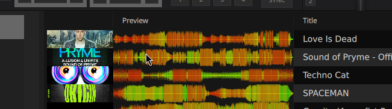

It is worth to say that we could add further customizable property, such as axis coloring.

## Alternatives

An alternative could be to double down on the existing theme and not pursue the existing QML draft theme. However,
after showing this interface a to a few user, them do seem to like the idea of a fresh look to Mixxx and it seems this
could be a tter direction. One way to confirm this hypotheseis could be to run survey across our various platform to
see what the community thinks.

## Action Plan

The action plan will consist of completing work items captured in
[the associated Github project](https://github.com/orgs/mixxxdj/projects/3).
There will likely some ground work required, but as we acknowledge that QML interface is unstable, it is
likely that progress could be made fast, as we get components implemented, alongside core setup (eg Library, Settings,
...)
